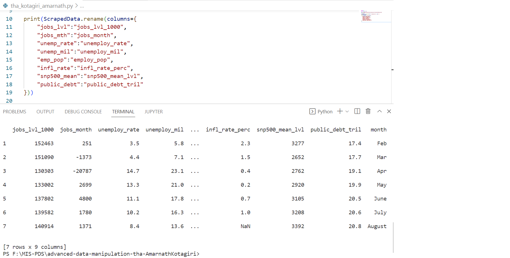

# Advanced Data Manipulation THA - Submission
This is the submission for `Kotagiri Amarnath`.

### Filtering & Querying with Pandas
Below is the screenshot for Column Rename

Below is the screenshot for Calculate the Mean & Median

Below is the screenshot for Column names which start with J or A

Below is the screenshot for Filtering Data which is greater than 135,000

Below is the screenshot for Piping the Data Using Pandas

Below is the screenshot for Using Piping on ScrapedData

Below is the screenshot for Using Piping and Aggregate on ScrapedData

### Using the query you just performed, calculate the mean and median of jobs_lvl_1000. How does it compare to the answers above?
The difference between the previous mean & median and the current mean & median is, current aggregation is on top of filtered data where as the previous aggregation is just mean & median on whole data.